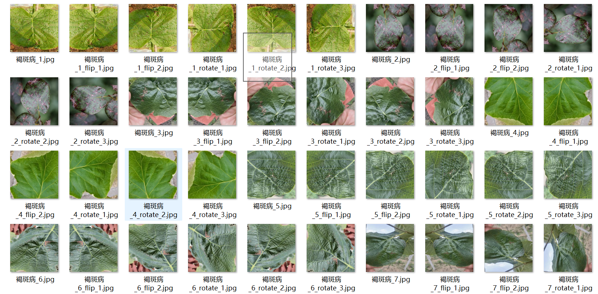
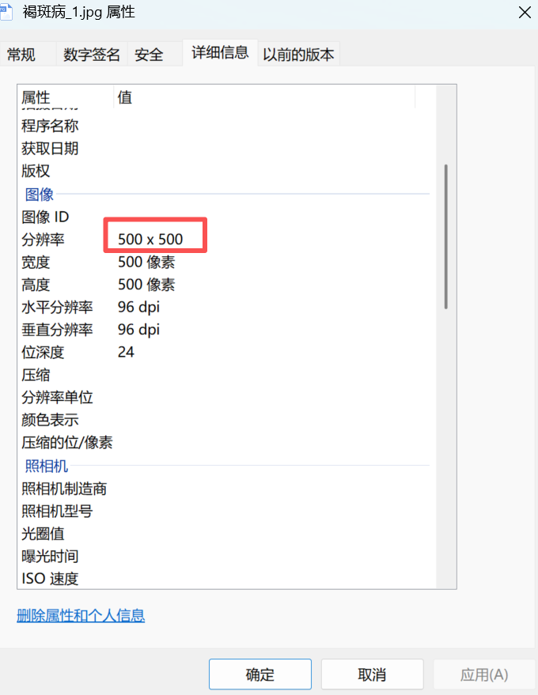
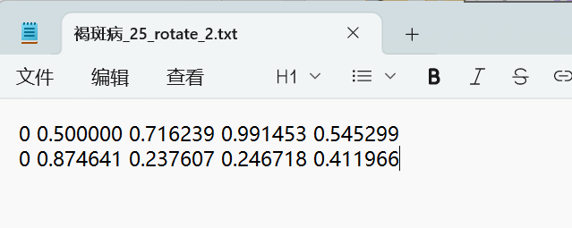
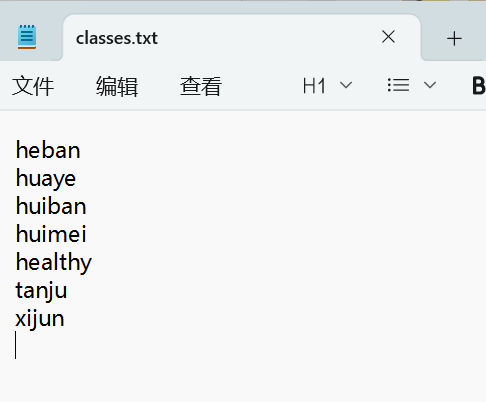
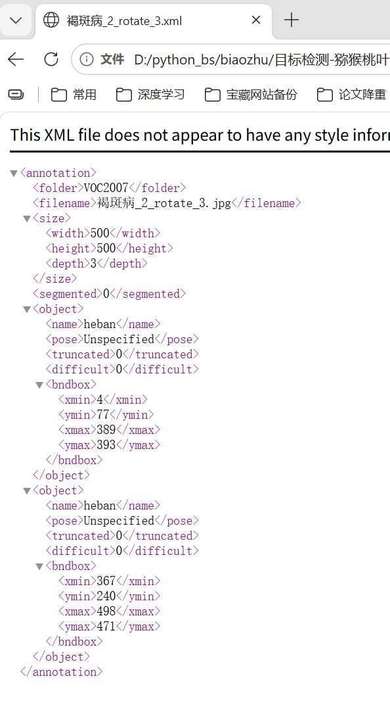
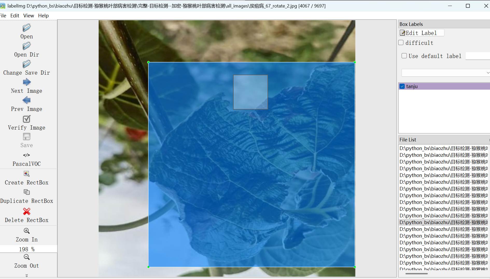
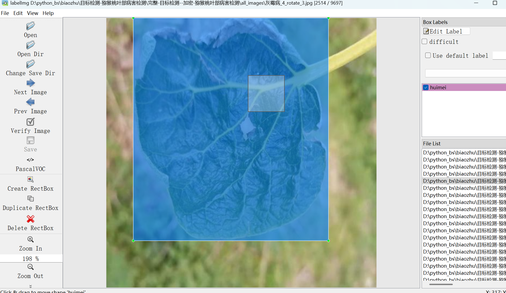
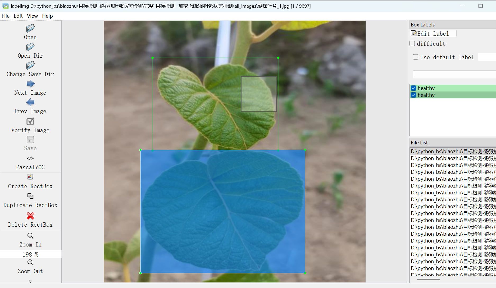

# 7 Species of Pomelo Leaf Diseases - Target Detection Dataset

Dataset Information: The dataset consists of 9697 images and corresponding annotation files.
Annotation files are provided in two formats: VOC-formatted xml files and YOLO-formatted txt files.
The annotated objects include the following:
['heban', 'huaye', 'huiban, 'huimei', 'healthy', 'tanju', 'xijun']
The number of bounding box annotations is as follows: (Annotations are usually in English, with Chinese characters inside brackets for reference.)
Note: An image may contain multiple annotations, so the total number of bounding boxes might be greater than the number of images.
A complete dataset includes three folders and a txt file:
all_images folder: Stores the dataset's images, screenshot included:
Image size information:
all_txt folder and classes.txt: Stores the yolo-formatted txt annotation files, in the same quantity as the images, each annotation file corresponds to one image.
For a detailed understanding of the standard YOLO-formatted files, please search for it yourself on Baidu. In short, index 0 represents the name at the array position 0 in classes.txt.
all_xml folder: VOC-formatted xml annotation files.
In the same quantity as the images, each annotation file corresponds to one image.
For a detailed understanding of the VOC-formatted standard files, please search for it yourself on Baidu.
Both formats of annotation can be used, choose one of them according to your preference.
Annotation effect screenshot:

## Images

Here is a pay link on Stripe ( https://buy.stripe.com/3cs8yP7sY87d0vu9AB ). Please contact me lonlonago@foxmail.com after funding $89, and I will send you a complete data files , thank you!

